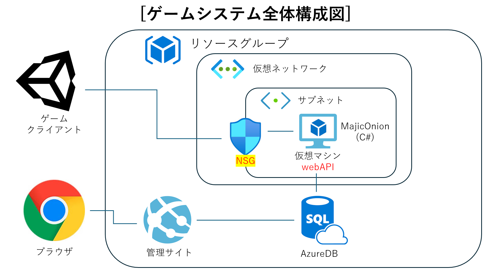
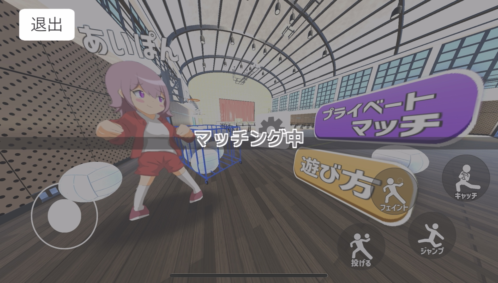
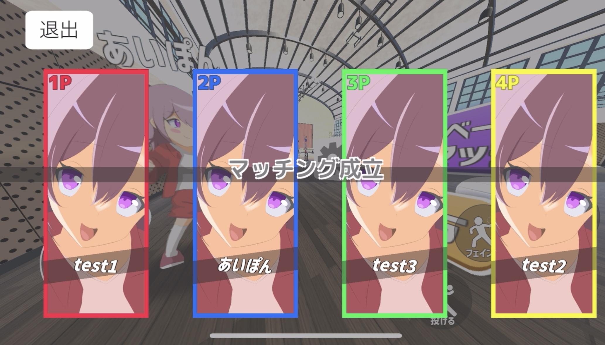
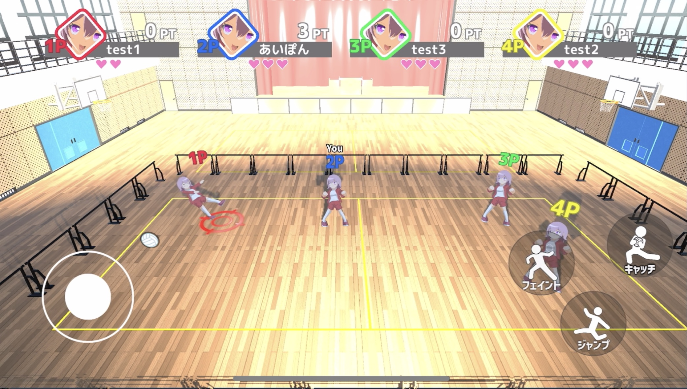
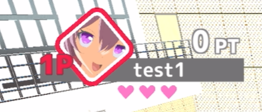
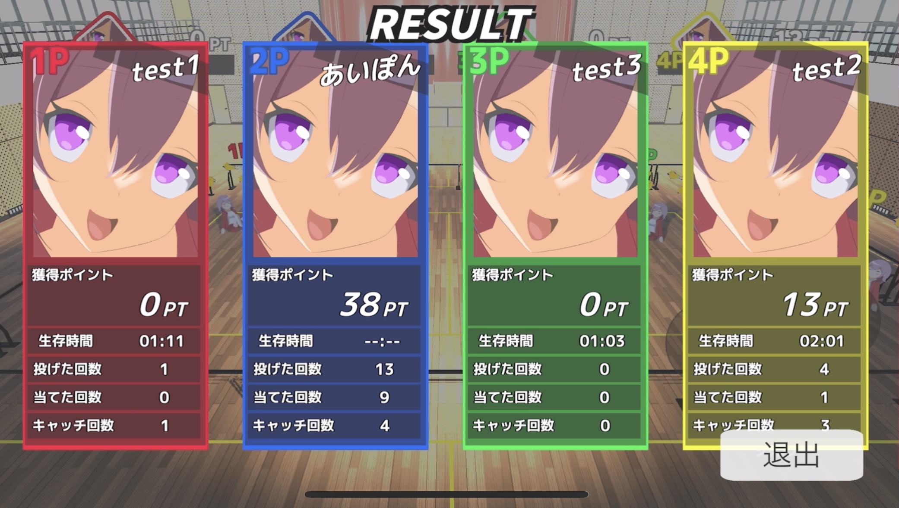

# Gaudy Drive 説明書
## このアプリについて
* フィールドに設置されたボールを獲得して他プレイヤーにぶつけてスコアを稼ぎ、勝利を目指す3Dドッジボールゲームです。
  * サーバーサイドをMajicOnionで開発し、クライアントサイドをUnityで制作いたしました。
  * クラウドサービスはMicrosoft Azureを使用しており、双方向で通信を行うリアルタイムゲームとなっております。
  * RPC形式で秒間約50回ほど通信を行っており、プレイヤーやボール座標の位置同期が行われています。
* ### システム構成図
　

## マッチング機能
* MajicOnionで開発したサーバーをMicrosoft AzureのVMで常時起動しています。
  * ランダムマッチは全国のユーザーを対戦することが出来ます。
  * プレイベートマッチはルーム名を友達と共有することで特定のユーザーと対戦することが出来ます。

## マッチング例
* マッチボタンを押すと自動的に募集が開始され、人数が集まると自動的にゲームが始まります。
  
* ### マッチング待機画面
　

* ### マッチング成功画面
　

## ゲーム画面
* 人数が集まると自動的に試合が開始されます。
  * プレイヤーはフィールド上にあるボールを他プレイヤーに投げ合いライフを削り、スコアを稼いで競い合います。
  * スコアは投げたプレイヤーと当てられたプレイヤーの距離によって得点が変動します。
  * ライフをすべて失ったプレイヤー動けなくなり、その時点で獲得していた得点が最終スコアとなります。
* ### ゲーム画面
　

* ### ボール取得
　

* ### ヒット
　

* ### UI
　
　* 各プレイヤーのスコアや残りライフは画面上部のUIで確認することが出来ます。

 ## ゲーム終了
* 残りプレイヤーが一人になった時点でゲームが終了し、リザルト画面へ遷移します。
  * 自身の戦績データを他プレイヤーのクライアントに送信し、リザルトで共有します。
    
* ### リザルト画面
　

